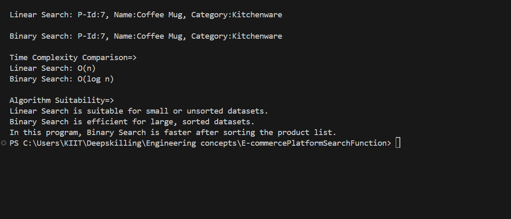

Big O Notation:
Describes algorithm complexity based on input size.

Search Time Complexities:

Linear Search:
Best: O(1)
Average: O(n)
Worst: O(n)

Binary Search (sorted):
- Best: O(1)
- Average: O(log n)
- Worst: O(log n)

Output Screen Shot =>

