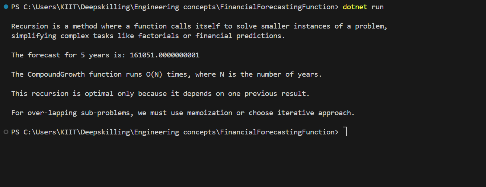

Recursion is a method where a function calls itself to solve smaller instances of a problem, simplifying complex tasks like factorials or financial predictions.

Time Complexity Analysis and Optimization =>

The CompoundGrowth function runs O(N) times, where N is the number of years.

This recursion is optimal only because it depends on one previous result.

For over-lapping sub-problems, we must use memoization or choose iterative approach.

Output Screenshot =>

